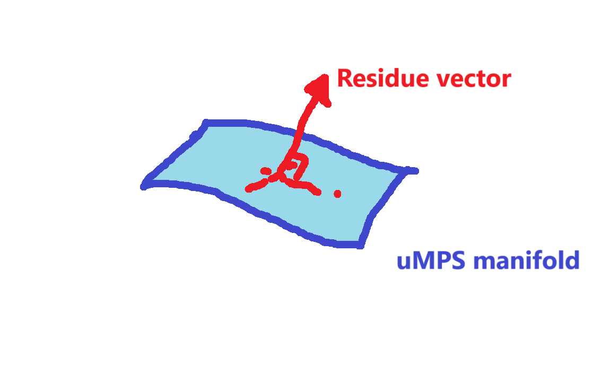
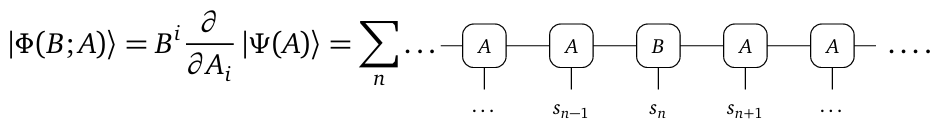
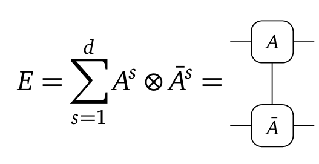

# Two-site VUMPS 

## Problem description
We want to find an algorithm that does the following:
### Input
- Hamiltonian of form 
$$H=\sum_n h_{n,n+1}$$
- uMPS of given bond dimensions $A \in \mathbb C^{\chi}\otimes \mathbb C^{phy} \otimes \mathbb C^{\chi'}$

### Ouput
- Approximate solution to the minimization problem 
$$\min_{A\in \text{NuMPS}} \frac{\braket{\psi(\bar A)|H|\psi(A)}}{\braket{\psi(\bar A)|\psi(A)}}$$
- where $\bar A$ simply denotes the conjugate of uMPS $A$ and the braket notation here refers to the inner product in thermodynamic limit 
- NuMPS denotes the set of all uMPS normalized in thermodynamic limit 

## Approach (Conceptual)
We can differentiate the equation directly (at least formally), and obtain the optimal condition. Importantly, this lead to the following condition
$$\bra{\partial_{\bar i} \psi(\bar A^*)} (H-E(\bar A^*,A^*))\ket{\psi(A^*)}$$
where $A^*$ denotes the optimal solution to the variational problem. Geometrically, if we imagine embedding our manifold of uMPS states into the larger, full Hilbert space, this condition is simply saying that the residue vector 

$$(H-E(\bar A^*,A^*))\ket{\psi(A^*)} \in T_p(A^*)^\perp$$

i.e. the residue is orthogonal to the tangent space at point $A^*$, which make sense because if it wasn't perpendicular, we can move a little bit along the tagent plane and get a smaller residue. It is also called a **Galerkin condition** (Actually I have not idea what that is, but the paper is using it, so I'll use it). Pictorially,

## Approach (In detail)
Now we want to derive the equation associated with this optimization procedure and cast everything in terms of the uMPS parameters inputs $A_L, A_R, C$ 

### Step 1: Tangent space formalism
Consider a uniform matrix product state parameterized by a single tensor $A$ on a infinite lattice. Taking derivative with respect to $A$ gives the tangent vector in state spae

The sum over all lattice site is a consequence of product rule.

One important feature of the MPS parameterization is gauge invariance, i.e. replace $A^s \to U^{-1} A^s U$ will not change the underlying state. If the gauge transformation is generated by $e^{-\epsilon X}$ where $X$ arbitary, then 

where $E$ is the transfer matrix 
